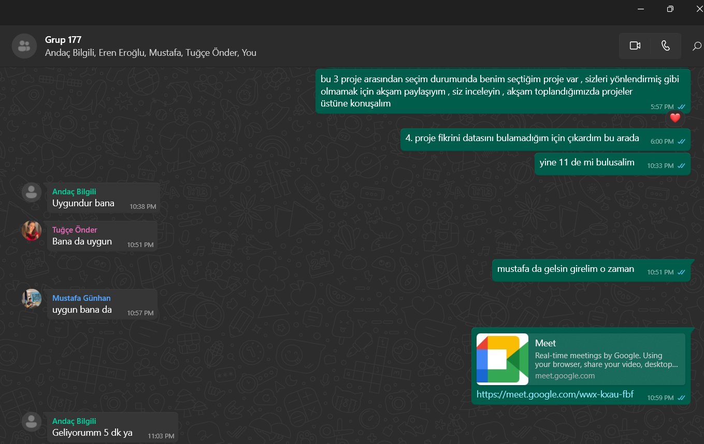
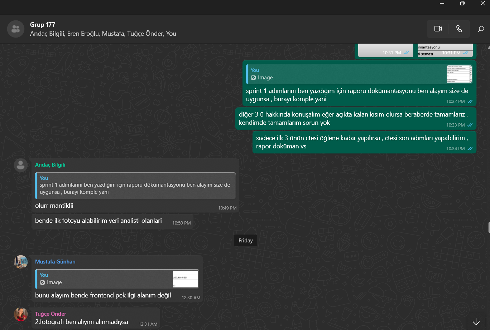
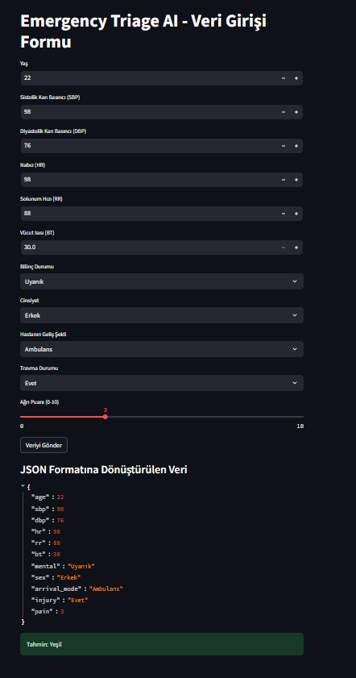
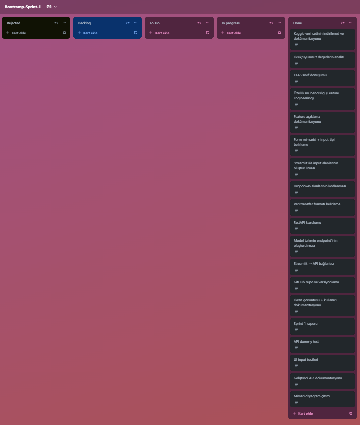
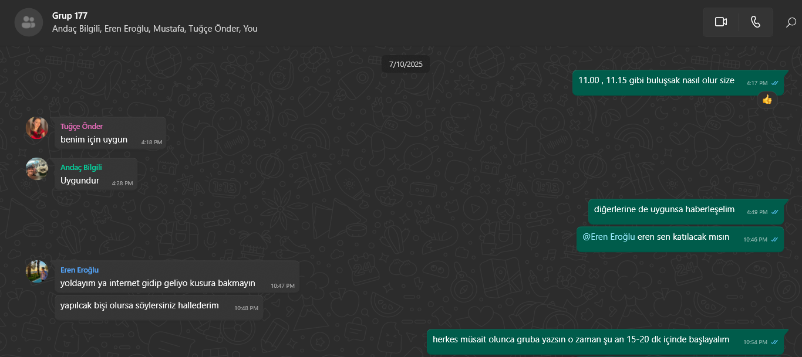
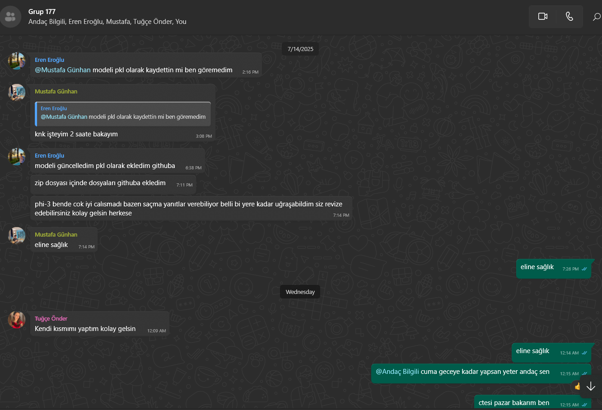
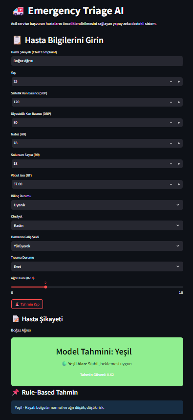
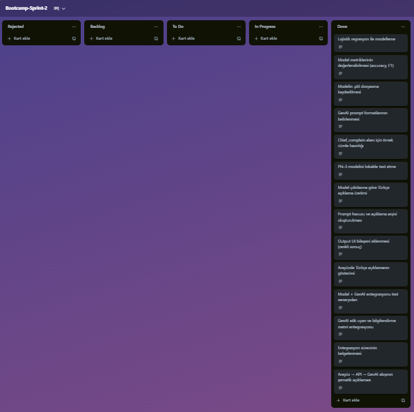

# Emergency Triage AI 

## Takım Bilgileri

**Takım Adı**: Takım 177  
**Proje Adı**: Emergency Triage AI  

**Takım Üyeleri:**
- Andaç Bilgili – Project Owner
- Serdar Dursun – Scrum Master
- Mustafa Günhan – Developer
- Tuğçe Önder – Developer
- Eren Eroğlu – Developer

## Tanıtım

Emergency Triage AI, acil servislerde hastaların önceliklendirilmesi sürecine yapay zekâ tabanlı destek sunmayı amaçlayan bir karar destek sistemidir. Proje, kamuya açık bir acil servis veri seti üzerinde çalışarak, sağlık personelinin daha etkili ve hızlı karar almasını destekleyecek bir uygulama geliştirmeyi hedeflemektedir. Projede kullanılan veri setinde KTAS (Korean Triage and Acuity Scale) skorları hedef değişken olarak ele alınmış ve sınıflandırma modeliyle tahminlenmesi amaçlanmıştır.

---
# SPRINT 1 – Ayrıntılı İş Kırılımı ve 100 Puanlık Puanlandırma

Sprint 1 kapsamında, temel veri altyapısı kurulmuş, giriş arayüzü hazırlanmış ve FastAPI ile API bağlantısı sağlanarak uçtan uca çalışan bir prototip oluşturulmuştur.

## 🔧 Sprint 1 Kapsamında Gerçekleştirilenler (Toplam 100 Puan)

- Kaggle veri setinin indirilmesi ve dokümantasyonu ✅
- Eksik/uyumsuz değerlerin analizi ✅
- KTAS sınıf dönüşümü ✅
- Özellik mühendisliği ✅
- Feature açıklama dokümantasyonu ✅
- Form mimarisi ve input tipi belirleme ✅
- Giriş inputlarının entegresi ✅
- Dropdown alanlarının kodlanması ✅
- Veri transfer formatı belirleme ✅
- FastAPI kurulumu ✅
- Tahmin endpoint'inin oluşturulması ✅
- Streamlit → API bağlantısı ✅
- GitHub repo oluşturma ve branch yapısı ✅
- Ekran görüntüsü ve kullanıcı dokümantasyonu ✅
- Sprint 1 özet raporu hazırlanması ✅
- API dummy veri testleri ✅
- UI input testleri ✅
- Geliştirici API dokümantasyonu ✅
- Uygulama mimarisi şeması ✅

🌟 **Sprint 1 toplam 100 puan olarak hedeflenmiş ve başarıyla tamamlanmıştır.**

---

## 🗓️ Sprint Notları

- **Sprint Süresi**: 17 gün  
- **Sprint Zaman Aralığı**: 20 Haziran 2025 – 6 Temmuz 2025
- **Sprintin Hedefi**: 
  - Acil servis triaj sürecini destekleyecek bir yapay zekâ modelinin veri hazırlık altyapısının oluşturulması,
  - Sağlık personelinin kullanıcı girişi yapabileceği bir arayüz geliştirilmesi,
  - API ile tahmin hizmetinin uçtan uca çalıştırılmasıdır.
- **Planlanan Görev Sayısı**: 19  
- **Gerçekleştirilen Görev Sayısı**: 19  
- **Sprint Performansı**: 100/100 puan başarıyla tamamlandı.

Sprint boyunca tüm ekip üyeleri rol tanımlarına uygun şekilde görevlerini tamamlamış ve günlük koordinasyon sağlanmıştır. Zaman yönetimi başarılı şekilde uygulanmış, plan dışı gecikme veya aksama yaşanmamıştır.

## 💬 Daily Scrum

Günlük iletişimler Google Meet ve WhatsApp grubu üzerinden gerçekleştirilmiştir. Ekip üyeleri gün başında görev paylaşımı ve durum güncellemeleri yaparak ilerlemeleri koordine etmiştir. Aşağıda örnek iletişim ekran görüntüleri yer almaktadır:

  

## ✅ Ürün Durumu: Ekran Görüntüleri

Sprint 1 sonunda ortaya çıkan ürünün ekran görüntüsü aşağıda yer almaktadır:

## 📌 Trello Panosu

Sprint boyunca görev takibi, ilerleme durumu ve ekip koordinasyonu aşağıdaki Trello panosu üzerinden yürütülmüştür:

## 🔎 Sprint Review

Sprint sonunda yapılan değerlendirme toplantısında:
- Tüm görevlerin zamanında ve eksiksiz tamamlandığı,
- Kullanıcı arayüzünün temel işlevleri yerine getirdiği,
- API servisinin doğru tahmin sonuçları döndürdüğü,
- JSON formatında veri alışverişinin başarıyla gerçekleştiği gözlemlenmiştir.

Prototip seviyesindeki sistem, acil servis personelinin kullanımına uygun temel altyapıyı sağlamaktadır.

## ♻️ Sprint Retrospective

- Sprint süresince ekip içi iletişim etkili şekilde sağlanmıştır.
- Teknik zorluklar, ekip içinde iş birliği ile çözülmüş ve bilgi paylaşımı artmıştır.
- Kullanılan araçlar (Streamlit, FastAPI) ile ilgili deneyim kazanılmıştır.
- Bir sonraki sprintte model doğruluk oranının artırılması, kullanıcı deneyiminin iyileştirilmesi ve görsel çıktıların genişletilmesi hedeflenmektedir.

---

# SPRINT 2 – Ayrıntılı İş Kırılımı ve 120 Puanlık Puanlandırma

## 🗓️ Sprint Notları

- **Sprint Süresi**: 14 gün  
- **Sprint Zaman Aralığı**: 6 Temmuz 2025 – 20 Temmuz 2025  
- **Sprintin Hedefi**:  
  - Acil servis triaj sisteminde makine öğrenmesi modelinin geliştirilmesi ve API entegrasyonunun sağlanması,  
  - Streamlit tabanlı kullanıcı arayüzünün tamamlanması ve uçtan uca çalışabilir hale getirilmesi,  
  - Kullanıcıya hem **model tahmini** hem de **kural tabanlı tahmini** gösteren bir yapı kurulması,  
  - GenAI entegrasyonuna yönelik hazırlıkların yapılması (tam entegrasyon bir sonraki sprintte gerçekleştirilecektir).  
- **Planlanan Görev Sayısı**: 14  
- **Gerçekleştirilen Görev Sayısı**: 14  
- **Sprint Performansı**: 120/120 puan başarıyla tamamlandı.  

Sprint boyunca ekip üyeleri, sorumluluk alanlarına uygun şekilde görevlerini tamamlamış ve günlük koordinasyon sağlanmıştır. Tüm kritik bileşenler zamanında tamamlanmış, plan dışı gecikme yaşanmamıştır.

---

## ✅ Sprint 2 Kapsamında Gerçekleştirilenler
 
  - Logistic Regression modeli eğitildi ve doğrulandı.
  - Model performansı (Accuracy, F1) ölçüldü (sonuçlar düşük çıktı, Sprint 3’te iyileştirme planlandı).
  - Eğitilen model `joblib` formatında kaydedildi ve API’ye entegre edildi.
  - FastAPI ile model servis edildi.
  - API endpoint oluşturuldu ve Swagger üzerinden test edildi.
  - Streamlit tabanlı arayüz tasarlandı.
  - Kullanıcıdan alınan veriler API’ye iletilerek tahmin alındı.
  - **Model tahmini** ve **rule-based tahmin** UI üzerinde ayrı olarak gösterildi.
  - Tahmin sonuçları renk kodları ve açıklama kartlarıyla görsel olarak zenginleştirildi.
  - Prompt formatları tanımlandı, örnekler oluşturuldu.
  - Chief Complaint için örnek metinler hazırlandı.
  - Phi-3 modeli lokalde test edildi (tam entegrasyon Sprint 3’te yapılacak).  
  - Trello güncellemeleri ve görev takibi tamamlandı.
  - Daily Scrum toplantıları organize edildi ve kayıt altına alındı.
  - Ekran görüntüleri ve dokümantasyon için gerekli materyaller hazırlandı.

  🌟 **Sprint 2 toplam 120 puan olarak hedeflenmiş ve başarıyla tamamlanmıştır.**

---

## 🗂 Daily Scrum
Günlük iletişimler Google Meet ve WhatsApp grubu üzerinden gerçekleştirilmiştir. Ekip üyeleri gün başında görev paylaşımı ve durum güncellemeleri yaparak ilerlemeleri koordine etmiştir. Aşağıda örnek iletişim ekran görüntüleri yer almaktadır:

  
  

---

## 🖼 Ürün Durumu
Sprint 2 sonunda, kullanıcı arayüzü ve API entegrasyonu tamamlanmış olup, sistem uçtan uca çalışabilir hale getirilmiştir. Aşağıda, uygulamanın son durumu gösterilmektedir:

  

---

## ✅ Trello Panosu
Sprint 2 boyunca görev yönetimi için **Trello** kullanılmıştır. Aşağıda, ilgili sprint panosunun son durumu yer almaktadır:

  

---

## 🔍 Sprint 2 Review
- API ve kullanıcı arayüzü entegrasyonu sorunsuz şekilde gerçekleştirildi.
- Kullanıcı dostu arayüz geliştirildi ve renk kodlu tahmin kartları eklendi.
- Model ve rule-based sistem aynı ekranda karşılaştırmalı olarak gösterilmektedir.
- Model performansının düşük olduğu gözlemlendi; bu durum Sprint 3’te iyileştirilecek.
- GenAI entegrasyonu için hazırlıklar tamamlandı ancak entegrasyon bir sonraki sprintte yapılacak.

---

## ♻️ Sprint 2 Retrospective

- Sprint boyunca ekip içi iletişim etkili bir şekilde sağlanmış, görev dağılımı net ve zamanında tamamlanmıştır.
- API ve kullanıcı arayüzü entegrasyonu planlandığı gibi gerçekleştirilmiş ve sistem uçtan uca çalışabilir hale getirilmiştir.
- GenAI entegrasyonuna yönelik hazırlık çalışmaları yapılmış, ancak tam entegrasyon bir sonraki sprintte uygulanmak üzere planlanmıştır.
- Modelin doğruluk oranı beklentinin altında kalmıştır; bu durum Sprint 3 için öncelikli iyileştirme alanı olarak belirlenmiştir.
- Bir sonraki sprintte, model optimizasyonu ve GenAI modülünün sisteme entegre edilerek tahmin açıklamalarının kullanıcıya sunulması hedeflenmektedir.

---

## ⚠️ Etik Uyarı ve Bilgilendirme

Bu sistem, **acil servis triyaj süreçlerine destek sağlamak** amacıyla geliştirilmiş yapay zekâ tabanlı bir karar destek aracıdır.  
Verilen tahminler **yalnızca bilgilendirme amaçlıdır** ve tıbbi kararların yerine geçmez.  
Kesin tanı ve tedavi için mutlaka **yetkili sağlık personeline danışılmalıdır**.

---
