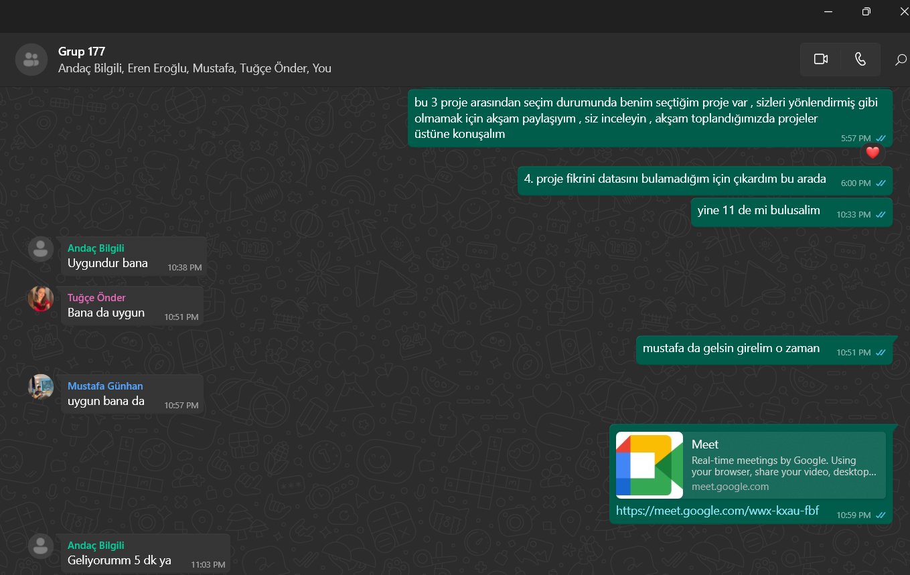
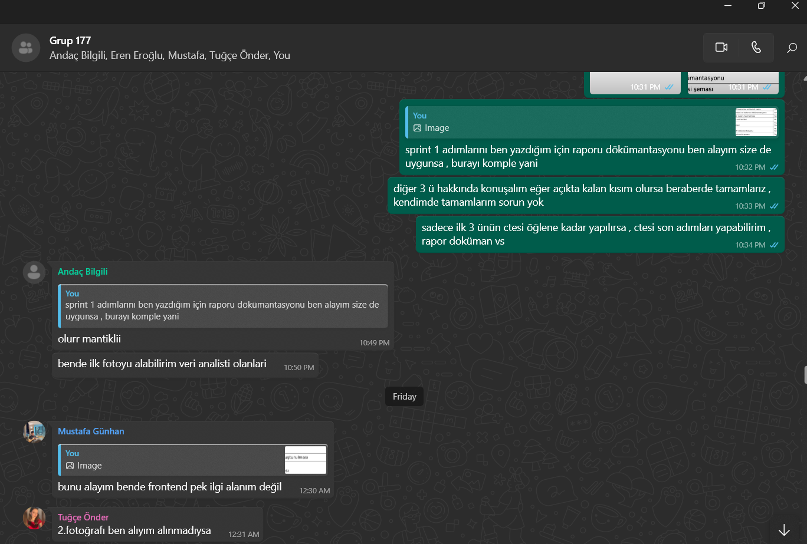
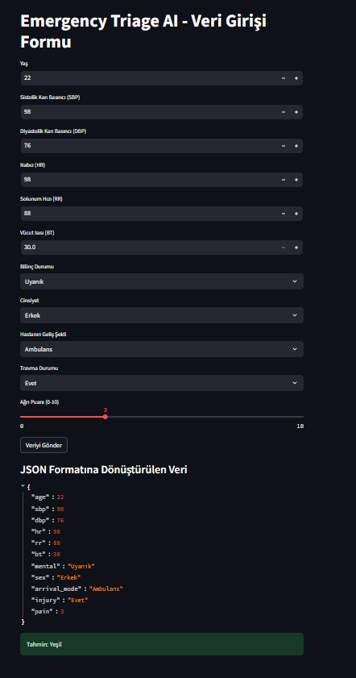
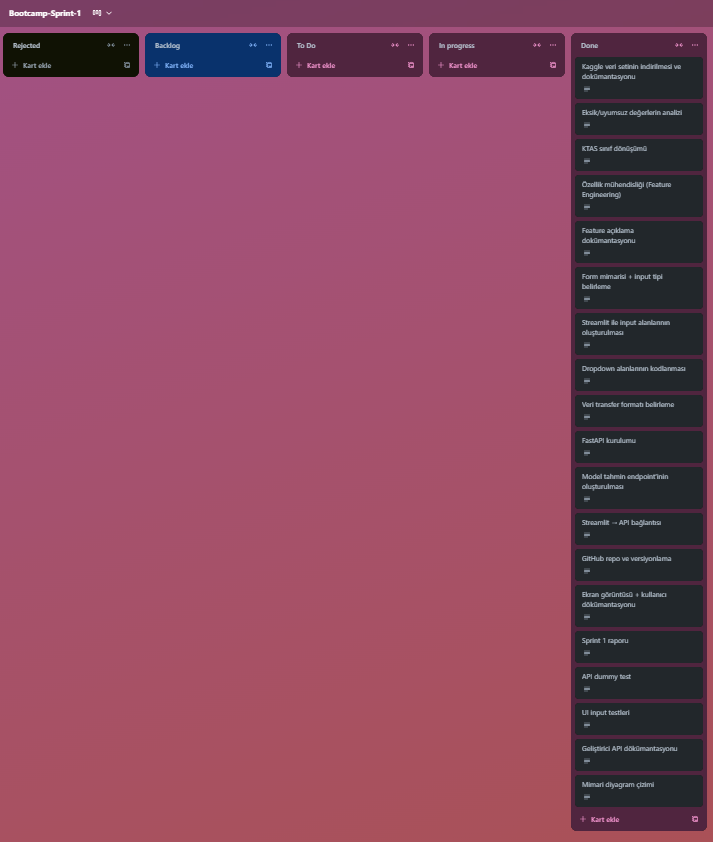

# Emergency Triage AI 

## Takım Bilgileri

**Takım Adı**: Takım 177  
**Proje Adı**: Emergency Triage AI  

**Takım Üyeleri:**
- Andaç Bilgili – Project Owner
- Serdar Dursun – Scrum Master
- Mustafa Günhan – Developer
- Tuğçe Önder – Developer
- Eren Eroğlu – Developer

## Tanıtım

Emergency Triage AI, acil servislerde hastaların önceliklendirilmesi sürecine yapay zekâ tabanlı destek sunmayı amaçlayan bir karar destek sistemidir. Proje, kamuya açık bir acil servis veri seti üzerinde çalışarak, sağlık personelinin daha etkili ve hızlı karar almasını destekleyecek bir uygulama geliştirmeyi hedeflemektedir. Projede kullanılan veri setinde KTAS (Korean Triage and Acuity Scale) skorları hedef değişken olarak ele alınmış ve sınıflandırma modeliyle tahminlenmesi amaçlanmıştır.

Sprint 1 kapsamında, temel veri altyapısı kurulmuş, giriş arayüzü hazırlanmış ve FastAPI ile API bağlantısı sağlanarak uçtan uca çalışan bir prototip oluşturulmuştur.

---

## 🔧 Sprint 1 Kapsamında Gerçekleştirilenler (Toplam 100 Puan)

- Kaggle veri setinin indirilmesi ve dokümantasyonu ✅
- Eksik/uyumsuz değerlerin analizi ✅
- KTAS sınıf dönüşümü ✅
- Özellik mühendisliği ✅
- Feature açıklama dokümantasyonu ✅
- Form mimarisi ve input tipi belirleme ✅
- Giriş inputlarının entegresi ✅
- Dropdown alanlarının kodlanması ✅
- Veri transfer formatı belirleme ✅
- FastAPI kurulumu ✅
- Tahmin endpoint'inin oluşturulması ✅
- Streamlit → API bağlantısı ✅
- GitHub repo oluşturma ve branch yapısı ✅
- Ekran görüntüsü ve kullanıcı dokümantasyonu ✅
- Sprint 1 özet raporu hazırlanması ✅
- API dummy veri testleri ✅
- UI input testleri ✅
- Geliştirici API dokümantasyonu ✅
- Uygulama mimarisi şeması ✅

🌟 **Sprint 1 toplam 100 puan olarak hedeflenmiş ve başarıyla tamamlanmıştır.**

---

## 🗓️ Sprint Notları

- **Sprint Süresi**: 17 gün  
- **Sprint Zaman Aralığı**: 20 Haziran 2025 – 6 Temmuz 2025
- **Sprintin Hedefi**: 
  - Acil servis triaj sürecini destekleyecek bir yapay zekâ modelinin veri hazırlık altyapısının oluşturulması,
  - Sağlık personelinin kullanıcı girişi yapabileceği bir arayüz geliştirilmesi,
  - API ile tahmin hizmetinin uçtan uca çalıştırılmasıdır.
- **Planlanan Görev Sayısı**: 19  
- **Gerçekleştirilen Görev Sayısı**: 19  
- **Sprint Performansı**: 100/100 puan başarıyla tamamlandı.

Sprint boyunca tüm ekip üyeleri rol tanımlarına uygun şekilde görevlerini tamamlamış ve günlük koordinasyon sağlanmıştır. Zaman yönetimi başarılı şekilde uygulanmış, plan dışı gecikme veya aksama yaşanmamıştır.

## 💬 Daily Scrum

Günlük iletişimler Google Meet ve WhatsApp grubu üzerinden gerçekleştirilmiştir. Ekip üyeleri gün başında görev paylaşımı ve durum güncellemeleri yaparak ilerlemeleri koordine etmiştir. Aşağıda örnek iletişim ekran görüntüleri yer almaktadır:

  

## ✅ Ürün Durumu: Ekran Görüntüleri

Sprint 1 sonunda ortaya çıkan ürünün ekran görüntüsü aşağıda yer almaktadır:

## 📌 Trello Panosu

Sprint boyunca görev takibi, ilerleme durumu ve ekip koordinasyonu aşağıdaki Trello panosu üzerinden yürütülmüştür:

## 🔎 Sprint Review

Sprint sonunda yapılan değerlendirme toplantısında:
- Tüm görevlerin zamanında ve eksiksiz tamamlandığı,
- Kullanıcı arayüzünün temel işlevleri yerine getirdiği,
- API servisinin doğru tahmin sonuçları döndürdüğü,
- JSON formatında veri alışverişinin başarıyla gerçekleştiği gözlemlenmiştir.

Prototip seviyesindeki sistem, acil servis personelinin kullanımına uygun temel altyapıyı sağlamaktadır.

## ♻️ Sprint Retrospective

- Sprint süresince ekip içi iletişim etkili şekilde sağlanmıştır.
- Teknik zorluklar, ekip içinde iş birliği ile çözülmüş ve bilgi paylaşımı artmıştır.
- Kullanılan araçlar (Streamlit, FastAPI) ile ilgili deneyim kazanılmıştır.
- Bir sonraki sprintte model doğruluk oranının artırılması, kullanıcı deneyiminin iyileştirilmesi ve görsel çıktıların genişletilmesi hedeflenmektedir.

---

Bu dokümantasyon yalnızca Sprint 1 kapsamını içermektedir. İlerleyen sprintlerde model optimizasyonu, açıklanabilirlik (XAI), kullanıcı değerlendirme metrikleri ve GenAI modülü entegresi planlanmaktadır.
